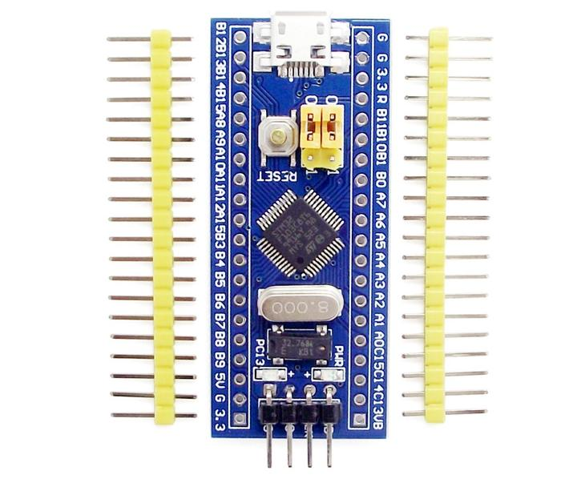
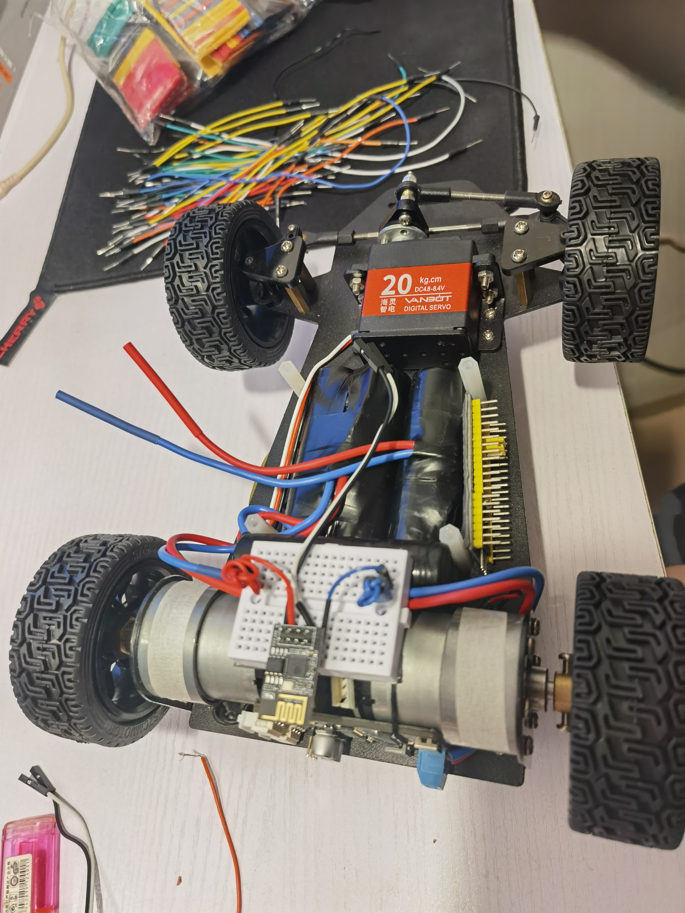

smartcar
==

# 项目概述

> * 本项目为STM32F103C8T6最小开发板的智能小车, 开发板如下
>

> * 基于flutter开发的手机控制端APP
> * ESP01S做为手机与小车之间的通信桥梁(wifi转串口)
> * 7W双电机后驱, 转速1500rmp, 最大速度3米每秒
> * 后期将使用3D打印小车的外壳模型加上颜色涂装

# 演示

开发中

成品

路测

# EPS01S AT指令

> * AT+RESTORE # 恢复出厂设置
> * AT+RST # Reset, 即重启, 不清除配置
> * AT+CWMODE=1 # 1:station模式 2:ap模式 3:sta+ap模式
> * AT+CWJAP="SSID","PWD" # SSID为要连接的WIFI的名称, PWD为要连接的WIFI的密码
> * AT+CIFSR # 查看连接WIFI后的IP和MAC地址
> * AT+CIPSTA? # 查看连接WIFI后的IP, 网关和子网掩码
> * AT+CIPMUX=0 # 开启单连接, 0单连接, 1多连接
> * ATE0 # 关闭回显
> * AT+CIPSTART="TCP","192.168.2.188",8888 # ESP01S以客户端形式连接TCP服务器192.168.2.188:8888
> * AT+SAVETRANSLINK=1,"192.168.2.188",8888,"TCP" # ESP01S以客户端形式连接TCP服务器192.168.2.188:8888, 并开机自动连接并进入透传
> * AT+CIPMODE=1 # 设置为透传模式
> * AT+CIPSTATUS # 查询网络连接状态
> * AT+CIPSEND # 开始透传发送, 目的是让ESP01S发送数据. "+++"三个+号结束透传发送
> * AT+CWMODE_DEF=1 # 配置WiFi模组工作模式为单STA模式，并把配置保存在flash
> * AT+CWAUTOCONN=1 # 使能上电自动连接AP
